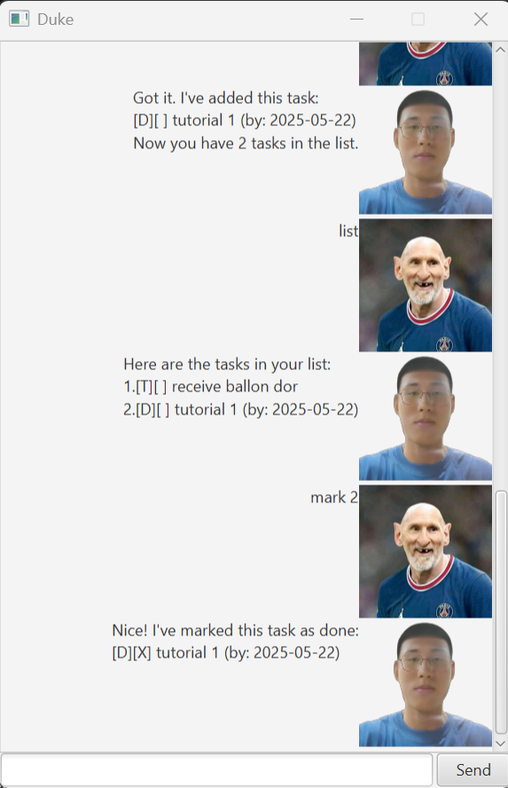

# These — User Guide

> Lightweight, keyboard-first task manager for the terminal (and GUI wrapper).
> **Tip:** Dates use ISO format `yyyy-mm-dd` (e.g., `2025-09-30`).



---

## Getting started

* **Run:** `java -jar these.jar` (or run `app.These` from your IDE)
* **Data File:** Tasks are saved to `data/tasks.txt` automatically after each command
* **User Guide:** Type `help` or `help <command>`

---

## Quick reference (commands)

| Command                                        | What it does                                  |
| ---------------------------------------------- | --------------------------------------------- |
| `help` / `help <cmd>`                          | Show this page or detailed help for a command |
| `list`                                         | List all tasks                                |
| `todo <desc>`                                  | Add a Todo                                    |
| `deadline <desc> /by yyyy-mm-dd`               | Add a Deadline                                |
| `event <desc> /from yyyy-mm-dd /to yyyy-mm-dd` | Add an Event with a date range                |
| `mark <n>`                                     | Mark task *n* as done                         |
| `unmark <n>`                                   | Unmark task *n*                               |
| `delete <n>`                                   | Delete task *n* (1-based index)               |
| `clear`                                        | Remove all tasks                              |
| `find <keywords>` *(if enabled)*               | Search tasks containing keywords              |
| `bye`                                          | Exit                                          |

> Indices are **1-based**. After you add a task, the app prints how many tasks you now have.

---

## Adding deadlines

Add a task with a due date.

**Usage**

```
deadline <description> /by yyyy-mm-dd
```

**Example**

```
deadline CS2103 iP v2 /by 2025-10-01
```

**Expected outcome**

```
Got it. I've added this task:
[D][ ] (id: 3) CS2103 iP v2 (by: 2025-10-01)
Now you have 3 tasks in the list.
```

**Notes**

* Date must be ISO `yyyy-mm-dd`. If invalid, you’ll see an error like:

  ```
  Error: Date must be in yyyy-mm-dd format.
  ```

---

## Adding todos

**Usage**

```
todo <description>
```

**Example**

```
todo read SICP
```

**Expected outcome**

```
Got it. I've added this task:
[T][ ] (id: 1) read SICP
Now you have 1 task in the list.
```

---

## Adding events

Create a task with a start and end date.

**Usage**

```
event <description> /from yyyy-mm-dd /to yyyy-mm-dd
```

**Example**

```
event Hackathon /from 2025-11-15 /to 2025-11-16
```

**Expected outcome**

```
Got it. I've added this task:
[E][ ] (id: 2) Hackathon (from: 2025-11-15, to: 2025-11-16)
Now you have 2 tasks in the list.
```

**Validation**

* Both `/from` and `/to` are required
* `/to` must be **on or after** `/from`

---

## Listing tasks

**Usage**

```
list
```

**Expected outcome**

```
Here are the tasks in your list:
1.[T][ ] read SICP
2.[E][ ] Hackathon (from: 2025-11-15, to: 2025-11-16)
3.[D][ ] CS2103 iP v2 (by: 2025-10-01)
```

---

## Marking / unmarking tasks

**Usage**

```
mark <n>
unmark <n>
```

**Example**

```
mark 1
```

**Expected outcome**

```
Nice! I've marked this task as done:
[T][X] read SICP
```

---

## Deleting a task

**Usage**

```
delete <n>
```

**Example**

```
delete 2
```

**Expected outcome**

```
Noted. I've removed this task:
[E][ ] Hackathon (from: 2025-11-15, to: 2025-11-16)
Now you have 2 tasks in the list.
```

---

## Clearing all tasks

**Usage**

```
clear
```

**Expected outcome**

```
Cleared 2 tasks.
```

*(Message may vary: “All tasks cleared!” in some versions.)*

---

## Finding tasks (optional feature)

**Usage**

```
find <keywords>
```

**Example**

```
find CS2103
```

**Expected outcome**

```
Here are the matching tasks:
3.[D][ ] CS2103 iP v2 (by: 2025-10-01)
```

---

## Help

**Usage**

```
help
help <command>
```

**Examples**

```
help
help deadline
```

**Expected outcome (partial)**

```
These — Help
----------------------------------------
help                    Show this page
help <cmd>              Show details for a command
list                    List all tasks
todo <desc>             Add a Todo
deadline <desc> /by yyyy-mm-dd
                        Add a Deadline
event <desc> /from yyyy-mm-dd /to yyyy-mm-dd
                        Add an Event
mark <n>                Mark task n as done
unmark <n>              Unmark task n
delete <n>              Delete task n
clear                   Remove all tasks
bye                     Exit
----------------------------------------
Tip: use ISO dates e.g., 2025-10-01.
```

---

## Exiting

**Usage**

```
bye
```

**Outcome**

* Prints a goodbye message and exits.
* Tasks are already persisted after each command.

---
